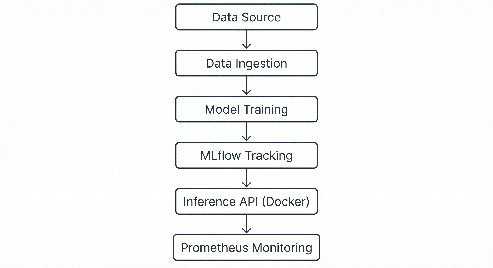

# End-to-End MLOps Pipeline

This project is a **mini MLOps system** built to understand how machine learning models are used in real-world applications, not just trained and tested locally.

The main goal of this project is to learn how the **complete ML lifecycle** works — from data ingestion and training to deployment and monitoring.

This project uses [GitHub Actions](.github/workflows/ci.yml) for CI: every push to `main` installs dependencies and runs ingest + config validation.

## Project Objective

In most college-level ML projects, the work usually stops after model training. However, in real industry projects, models must be deployed, tracked, and monitored.

This project was created to:

* Learn how ML models are deployed as services
* Track experiments and models using MLflow
* Serve predictions using a REST API
* Monitor the system using Prometheus

## System Architecture

**Flow of the project:**



Data Ingestion → Model Training → MLflow Tracking → Inference API → Monitoring

All services are managed using **Docker Compose**, which makes the setup simple and reproducible.

## Technologies Used

* **Programming Language:** Python
* **Machine Learning:** Scikit-learn
* **Experiment Tracking:** MLflow
* **Containerization:** Docker, Docker Compose
* **API:** REST-based inference service
* **Monitoring:** Prometheus

## Project Structure

```
mlops/
├── config/            # Configuration files
├── docker/            # Docker-related files
├── monitoring/        # Prometheus setup
├── scripts/           # Helper and automation scripts
├── src/               # Data ingestion, training, and API code
├── docker-compose.yml # Runs all services together
├── API.md             # API details
└── README.md
```

## How to Run the Project

### Step 1: Clone the Repository

```bash
git clone https://github.com/tejavardhan1/mlops.git
cd mlops
```

### Step 2: Start the Services

```bash
docker compose up -d
```

This starts MLflow Tracking Server, Model Inference API, and Prometheus.

### Step 3: Run ingest + train

```bash
docker compose --profile run-once run --rm train
```

This writes data and the trained model to `./models`.

### Step 4: Restart inference (load model)

```bash
docker compose restart inference
```

### Step 5: Check the API

```bash
curl -s http://localhost:8000/health
curl -X POST http://localhost:8000/predict -H "Content-Type: application/json" -d '{"features": [12,2,2,18,95,2,2.5,0.3,1.2,5,1,2.8,500]}'
```

## Model Training & Experiment Tracking

* The training pipeline ingests data and trains a machine learning model
* Each training run is logged using **MLflow**, which stores:
  * Model parameters
  * Evaluation metrics
  * Model files
* This helps in comparing different experiments and keeping track of model versions.

## Using the Inference API

**Health Check**

```bash
curl http://localhost:8000/health
```

**Prediction Request** (Wine dataset: 13 features)

```bash
curl -X POST http://localhost:8000/predict \
     -H "Content-Type: application/json" \
     -d '{"features": [12,2,2,18,95,2,2.5,0.3,1.2,5,1,2.8,500]}'
```

The API loads the trained model and returns predictions in JSON format.

## Monitoring

Prometheus is used to monitor the inference service. It collects:

* Number of API requests
* Response time
* Service availability

This helps understand how the model behaves after deployment.

## Cloud Deployment

The project can be deployed on cloud platforms like AWS EC2 using Docker: launch an Ubuntu instance, install Docker and Docker Compose, clone the repo, and run `docker compose up --build`. Access the API at `http://<EC2-PUBLIC-IP>:8000`.

## What I Learned

* Machine learning projects require more than just training models
* MLflow helps in tracking experiments and models
* Docker makes deployment easier and consistent
* Monitoring is important for production-ready ML systems

## Future Enhancements

* Expand CI/CD (e.g. deploy on release tag)
* Implement data drift detection
* Deploy the system on cloud platforms like AWS or GCP

## Author

**Teja Vardhan Reddy**

This project was built for learning MLOps concepts and gaining hands-on experience.
